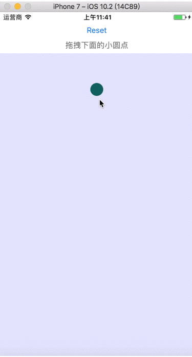

# ZLYSpringBubble

ZLYSpringBubble 是一个仿 QQ 未读消息拖拽气泡的工具。

效果⬇️⬇️⬇️



# 安装

1. CocoaPods

```
pod ‘ZLYSpringBubble’
```

2. 直接安装

   直接拽入ZLYWaterWave.h和ZLYWaterWave.m文件

# 使用

```objc
    _bubbleView = [[ZLYBubbleView alloc] init];
    _bubbleView.rootCircleCenter = CGPointMake([UIScreen mainScreen].bounds.size.width / 2, 70);
    _bubbleView.rootCircleR = 8;
    _bubbleView.floatingCircleR = 12;
    _bubbleView.maxDistance = 150;
    _bubbleView.bubbleColor = [UIColor colorWithRed:0 green:0.4 blue:0.4 alpha:1];
```

可调节参数：

```objc
/** 最大距离，超过最大距离气泡会断开，默认 100 */
@property (nonatomic, assign) CGFloat maxDistance;

/** 根圆点半径，默认 10.0 */
@property (nonatomic, assign) CGFloat rootCircleR;
/** 可拖拽圆点半径，默认 15.0 */
@property (nonatomic, assign) CGFloat floatingCircleR;

/** 根圆点圆心，默认 (0,0) */
@property (nonatomic, assign) CGPoint rootCircleCenter;
/** 可拖拽圆点圆心，默认和根圆点圆心一致 */
@property (nonatomic, assign) CGPoint floatingCircleCenter;

/** 默认 red */
@property (nonatomic, strong) UIColor *bubbleColor;

/**
 重置
 */
- (void)reset;

```

具体还可以参考 Demo 中的示例。

# 反馈

如果有什么修改建议，可以发送邮件到 <coderfish@163.com>，也欢迎到我的[博客](http://zhoulingyu.com)一起讨论学习哟~

